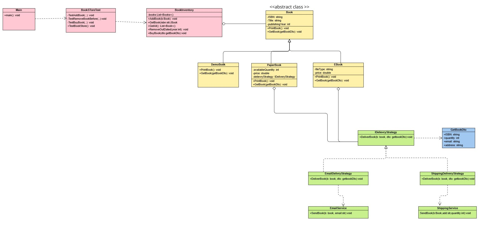

# Fawry Quantum Book Store 


## Design
* I thought that first to have an abstract class for book to carry the common book attributes & functionality 
* By Making a Common Book class we could then add new books easily
* In The book interface there is a **GetBook()** Method, each book method implements it differently 
  bec ebook needs to get book by email but paper book need shipment
* Some Book Types aggregates inside it the IDelivery Strategy so we could decide which method we will send the book with.
  for example Ebook initially takes an Email Service Strategy ,  this design helps us introduce new strategies easily
  also if the book strategy changed our classes could adapt easily


## Assumptions

* Demo Book Doesn't have a price
* EBook Doesn't have quantity
* I decide book is outdated if its year is less than the year provided by user


## Class Diagram



## Screen of working Program

### Adding Books
```java
books.add(new DemoBook("C122", "Fitness", 2012));
books.add(new DemoBook("C123", "C++ Best Practice", 2020));
books.add(new EBook("C124", "Java", "pdf", 2015, 100.45, emailStrategy));
books.add(new EBook("C125", "API Design", "pdf", 2017, 100.45, emailStrategy));
books.add(new PaperBook("C126", "API Design", 20, 2018, 50, shippingStrategy));
```


### Removing Book Before 2013


```java
TestRemoveBookBefore(bookInventory,2013);
```


### Buy Books

#### Buy 4 paper books

```java
 GetBookDto paperBookDto = new GetBookDto();
paperBookDto.ISBN = "C126";
paperBookDto.quantity = 4;
paperBookDto.address = "123 Street, Giza, Hadayek";
TestBuyBook(bookInventory, paperBookDto);
```


#### Buy EBook 
```java
System.out.println("Demo Book:  ");
GetBookDto demoBook = new GetBookDto();
demoBook.ISBN = "C123";
TestBuyBook(bookInventory, demoBook);
```


#### Buy Demo Book
```java
System.out.println("Demo Book:  ");
GetBookDto demoBook = new GetBookDto();
demoBook.ISBN = "C123";

TestBuyBook(bookInventory, demoBook);
```


### Buy Book With Invalid ISBN
```java
GetBookDto paperBookDto03 = new GetBookDto();
paperBookDto03.ISBN = "C1g6";
TestBuyBook(bookInventory, paperBookDto03);
```


#### Buy Book with invalid quantity

```java
GetBookDto paperBookDto02 = new GetBookDto();
paperBookDto02.ISBN = "C126";
paperBookDto02.quantity = 21;
paperBookDto02.address = "123 Street, Giza, Hadayek";
TestBuyBook(bookInventory, paperBookDto02);
```

